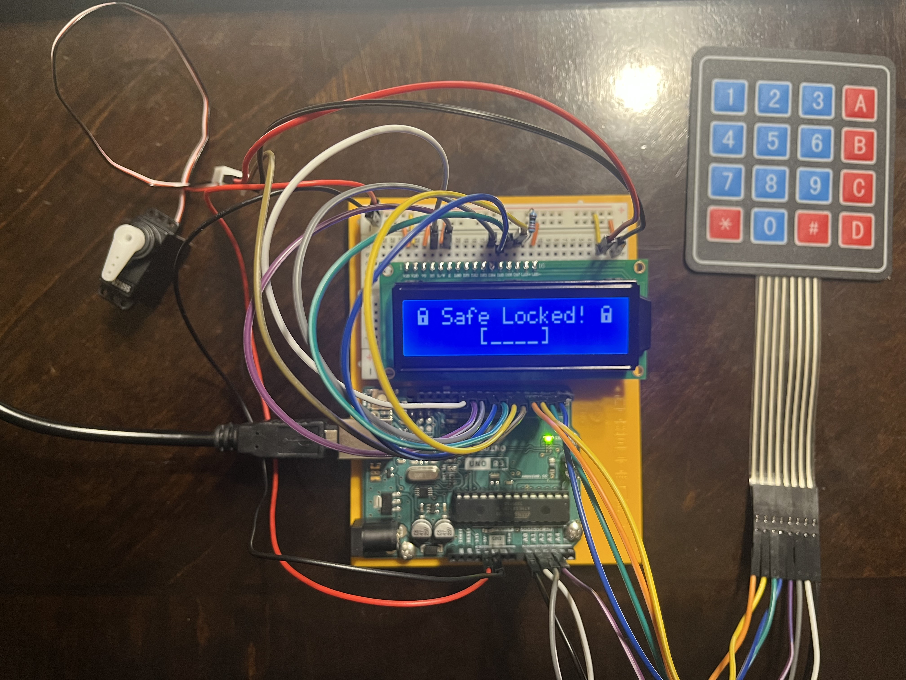

# Electronic Safe
This project implements an electronic safe, built using an Arduino Uno, LCD, keypad, and servo motor. This project was inspired by [Uri Shaked](https://github.com/urish).

## Demo
<p align="center">
  
</p>

Watch a [video demo](https://www.youtube.com/watch?v=GJqUD9L2F-I).

## Overview
This project simulates the core functionality of a digital safe. The LCD serves as a visual interface,
prompting users to enter a code, change the code, or lock the safe, with input provided from the keypad.
A servo motor serves as the physical locking mechanism. The program uses the Arduino's EEPROM (Electrically Erasable 
Programmable Read-Only Memory), which allows the safe to store the lock state and access code even after the 
Arduino is powered off.

## Getting Started
### Hardware Requirements
- Arduino compatible board, e.g. Uno
- 16x2 LCD display, HD44780 compatible
- 4x4 keypad
- Servo motor
- Jumper wires
- Breadboard (optional)

### Pin Connections
#### LCD
| LCD Pin | Arduino Pin |
|--------|-------------|
| VSS | GND |
| VDD | 5V |
| V0 | GND |
| RS | 12 |
| R/W | GND |
| E | 11 |
| DB4 | 10 |
| DB5 | 9 |
| DB6 | 8 |
| DB7 | 7 |
| LED+ | 5V (through 220Ω resistor) |
| LED- | GND |

#### Servo Motor
| Servo Wire | Arduino Pin |
|-----------|-------------|
| GND | GND |
| 5V | 5V |
| PWM | 6 |

#### Keypad (4x4)
| Keypad Pin | Arduino Pin |
|-----------|-------------|
| 1 | A0 |
| 2 | A1 |
| 3 | A2 |
| 4 | A3 |
| 5 | 2 |
| 6 | 3 |
| 7 | 4 |
| 8 | 5 |

### Running the Program
1. Clone the repository.
   
   ```bash
   git clone https://github.com/mbelov725/Electronic-Safe.git
   cd Electronic-Safe
3. Install the PlatformIO IDE extension.
4. Plug your board into a USB port of your computer.
5. To build the project, press the checkmark in the bottom left corner of the screen, or press ```Ctrl + Alt + B```.
6. To upload the project, press the arrow in the bottom left corner of the screen, or press ```Ctrl + Alt + U```.
7. Once you are done with the project, clear the EEPROM from your Arduino.
   
   Create an Arduino sketch.

   ```ino
   #include <EEPROM.h>

   #define EEPROM_ADDR_LOCKED   0
   #define EEPROM_ADDR_CODE_LEN 1
   #define EEPROM_ADDR_CODE     2
   #define EEPROM_EMPTY         0xff
   #define CODE_LENGTH          4
   
   void setup() {
     Serial.begin(9600);
   
     EEPROM.update(EEPROM_ADDR_LOCKED, EEPROM_EMPTY);
     EEPROM.update(EEPROM_ADDR_CODE_LEN, EEPROM_EMPTY);
     for (byte i = 0; i < CODE_LENGTH; ++i) {
        EEPROM.write(EEPROM_ADDR_CODE + i, EEPROM_EMPTY);
     }
   
     Serial.println("Arduino EEPROM cleared.");
   }

   void loop() {}